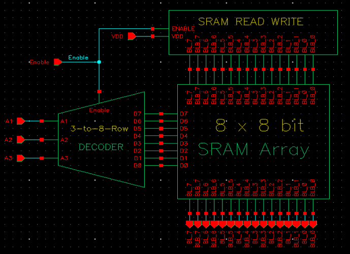
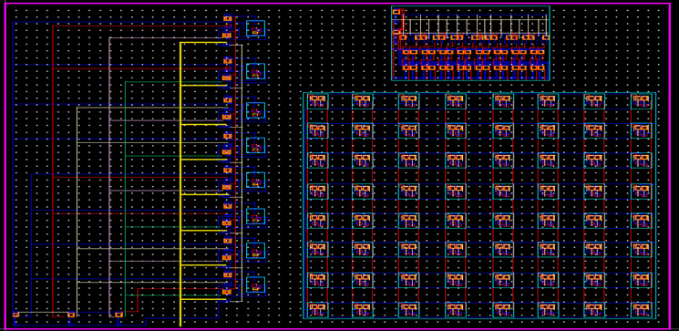
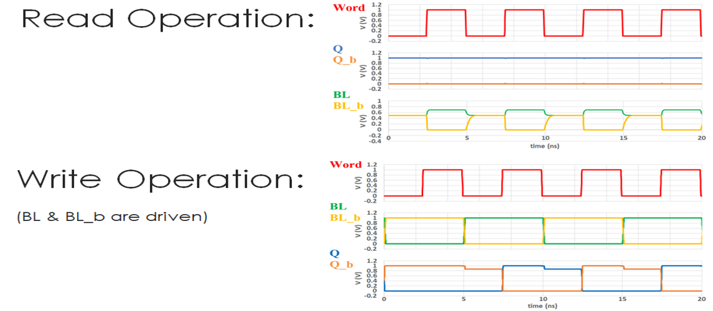

# 8×8 SRAM Memory System | VLSI Final Project ⚙️🔬

This repository hosts the final project for the Introduction to VLSI Design course at Braude Academic College of Engineering. It features the complete custom design and simulation of an 8×8 Static Random-Access Memory (SRAM) using Cadence Virtuoso, built with transistor-level CMOS components, full custom layout, and digital simulation.

## 📚 Project Overview
- 6T SRAM cells in 8×8 array (64 bits)
- Custom logic gates, decoder, read/write controls
- Cadence Virtuoso design, DRC/LVS clean
- Simulations for verification

## 🛠️ Design Flow
1. Gate-Level Design (custom logic gates)
2. Row Decoder (3-to-8 decoder)
3. 6T SRAM Cell (layout, simulation)
4. SRAM Array Integration (8×8 grid)
5. Read/Write Interface

## 📊 Performance Highlights

| Feature        | Specification      |
| -------------- | ----------------- |
| Cell Type      | 6T CMOS           |
| Array Size     | 8×8 (64 bits)     |
| Max Frequency  | 1.58 GHz (sim.)   |
| Layout Area    | 240 µm × 315 µm   |
| Verification   | DRC, LVS, Sim.    |

## 🖼️ Visual Artifacts

- **Block Diagram:** 
- **Layout Previews:** 
- **Simulation Waveforms:** 

## 📂 Repository Structure

```
.
├── README.md
├── LICENSE
├── docs/
├── schematics/
├── layout/
├── simulations/
```

## 📜 Documentation

- [`Final_Project_SRAM.pdf`](docs/Final_Project_SRAM.pdf): Full report.
- Stimulus files & waveforms in `/simulations/`, `/docs/`.
- Schematic/layout snapshots in `/schematics/`, `/layout/`.

## 🔭 Future Work

- Add sense amplifiers
- Implement column decoder
- Expand to 16×16 array
- Explore low-power techniques

## 👨‍💻 Authors
- Maria Nakhle
- Bshara Habib
- Francis Aboud
- Noor Zakour
